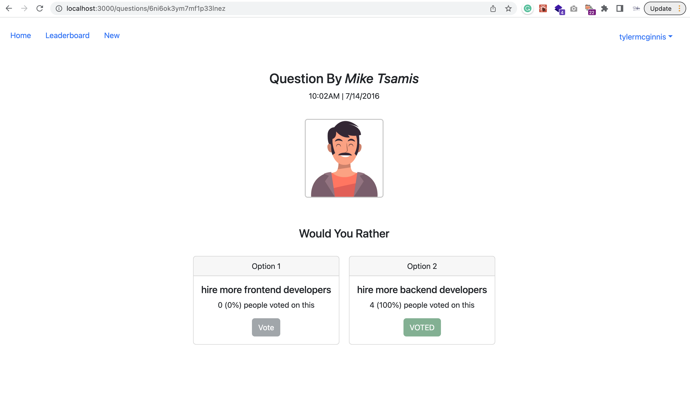
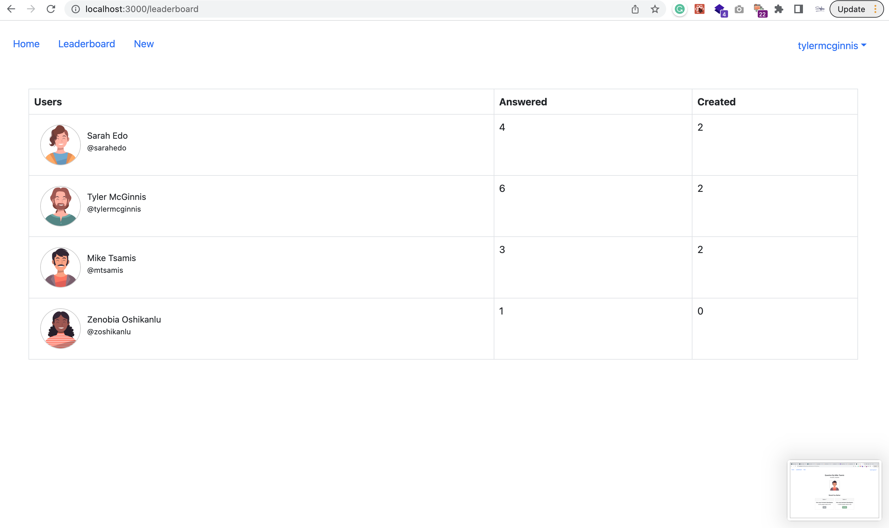
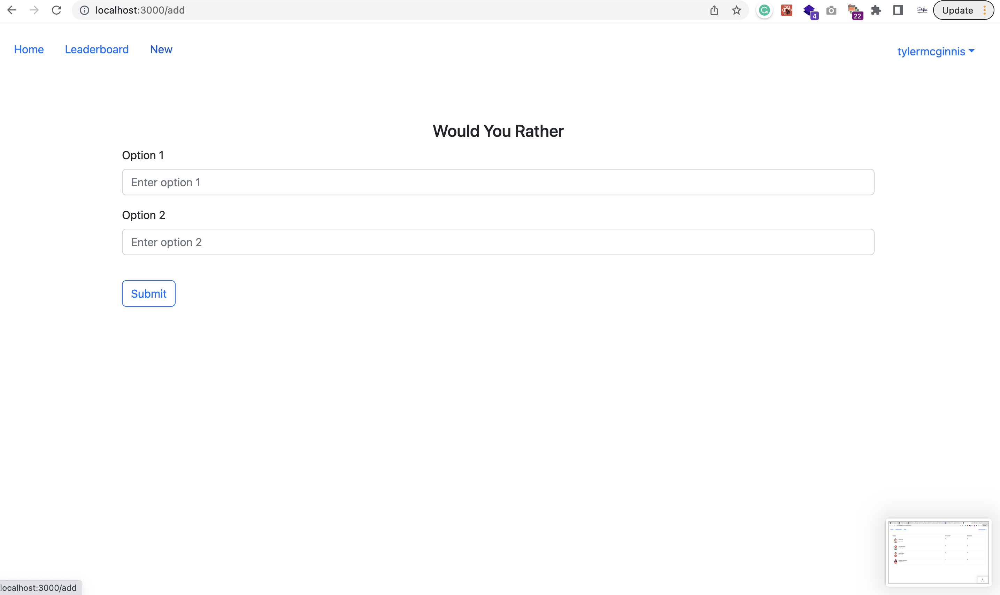
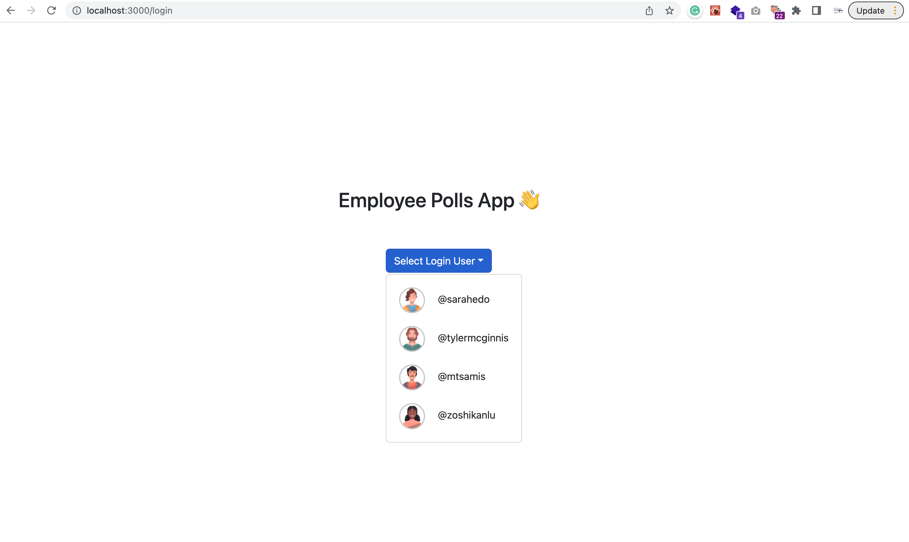
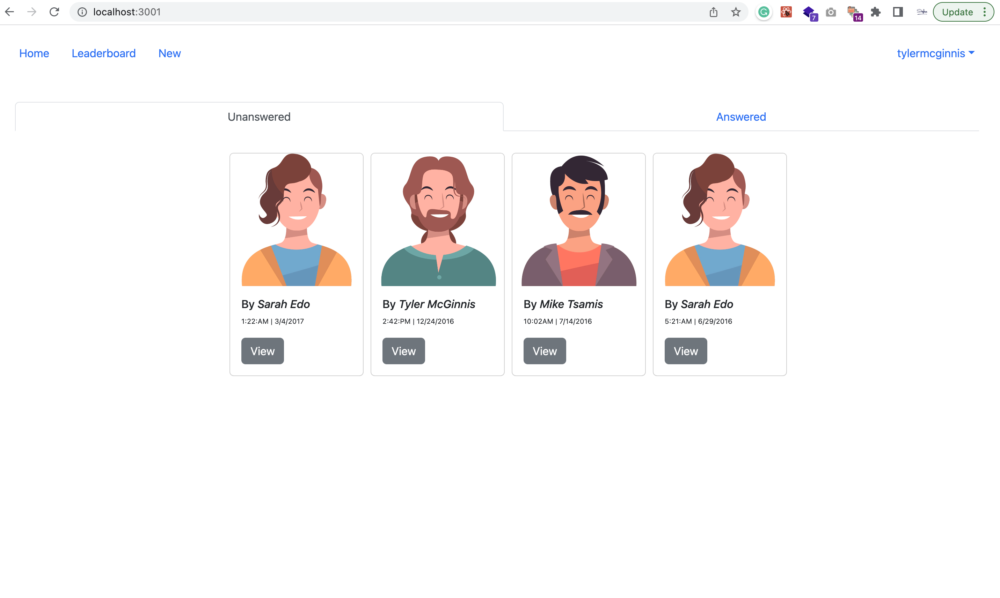

# Project title
Employee Polls

# Description
Employee Polls is a React application that let employees create and participate in polls together. Employer and other employees are able to see the leaderboard that contains statistics about employees polls and participation.

The project is built mainly to get hands-on experience with React/Redux. It can be improved in the future by:
 -- Create a real authentication, so users can sign up and login with their accounts.
 -- Create user profiles that hold their personal and polls data.
 -- Make user profiles accessible from leaderboard.

# Screenshots

- 
- 
- 
- 
- 

# Built With

- [React 18](https://reactjs.org/)
- [Redux](https://redux.js.org/)
- [React Redux](https://react-redux.js.org/)
- [React Bootstrap](https://react-bootstrap.github.io/getting-started/introduction)
- [React Redux Loading Bar](https://www.npmjs.com/package/react-redux-loading-bar)
- [Jest](https://jestjs.io/)
- [React Testing Library](https://testing-library.com/docs/react-testing-library/intro/)

# API
Initial data and APIs are create by Udacity team. Details about APIs are in `/src/utils/README.md`.
# Available Scripts

In the project directory, you can run:

### `npm start`

Runs the app in the development mode.
Open [http://localhost:3000](http://localhost:3000) to view it in your browser.

### `npm run test`
To run all the included included unit tests using Jest and React Testing Library.

# Author

Shefaa Saad - 2022